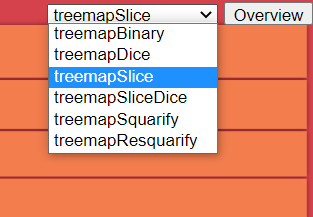
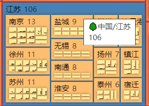
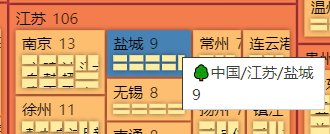
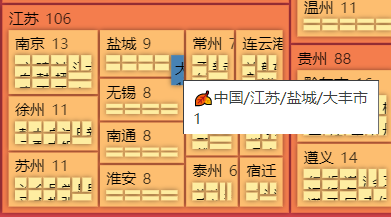
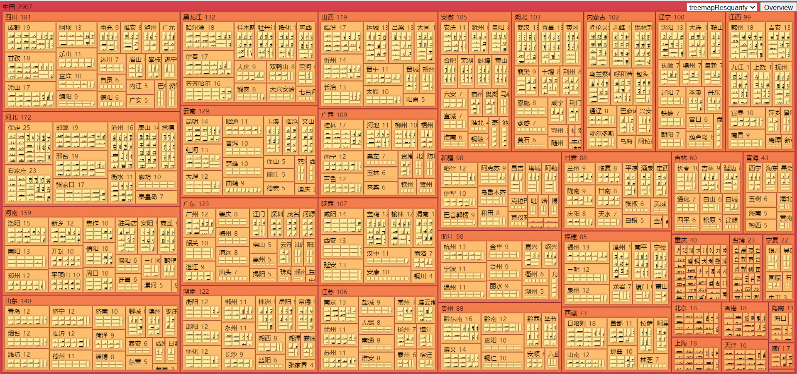
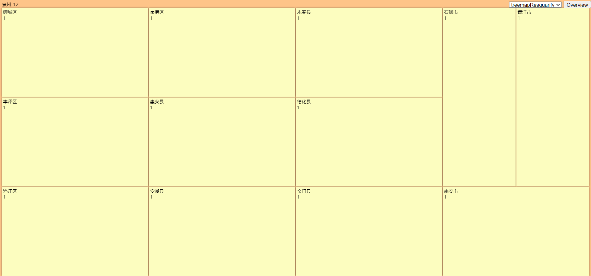
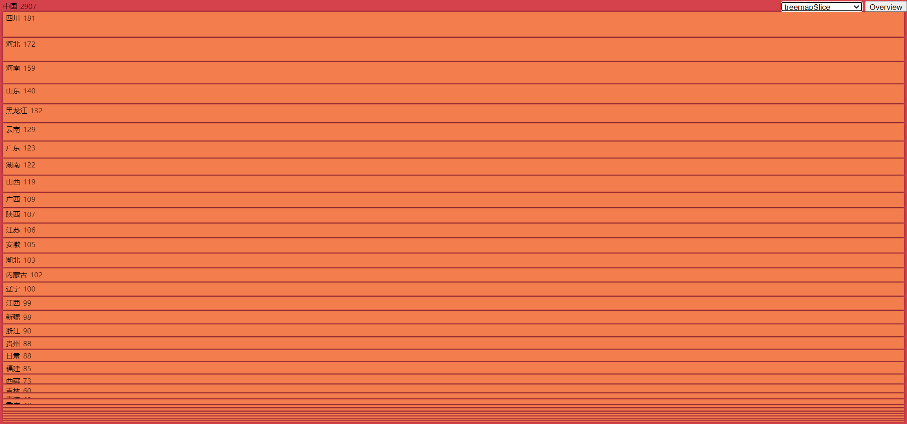

# 可视化 `d3` 实验报告

**姓名：周泽龙**
**学号：2020213990**
**课程：信息可视化与可视分析**
**日期：2020年12月1日**

------

## 1 实验环境

* 操作系统：`Windows 10` 
* 浏览器：`Chrome`
* 编程语言：`HTML`、`Javascript`、`Python`
* `IDE`：`Visual Studio Code`、`JetBrains PyCharm`
* 运行：直接打开 `index.html` 文件即可，无需创建 `server` 服务

## 2 实验选题

### 2.1 `Treemap`可视化与交互

#### 2.1.1 实验内容

* 基本内容
  * 基于中国行政区划信息数据集，实现 `Treemap` 的可视化，可切换6种布局算法：
    * `treemapBinary`、`treemapDice`、`treemapSlice`
      `treemapSliceDice`、`treemapSquarify`、`treemapResquarify`
  * 鼠标悬浮高亮选择的块，并显示块的相关信息
* 进阶内容
  * 可选择不同的布局算法
  * `zoomin` 和 `zoomout` 功能
    * 点击当前页面中的非叶子非根节点，可拉近放大查看子节点视图
    * 点击当前页面中的根节点，可拉远缩小查看父节点视图
  * 节点信息可区分叶子节点和非叶子节点
    * 叶子节点信息包含：🍂
    * 非叶子节点信息包含：🌳

#### 2.1.2 基本原理

* 利用 `d3.treemap()` 实现 `treemap` 布局，可切换 6 种布局算法：
  * `treemapBinary`、`treemapDice`、`treemapSlice`
    `treemapSliceDice`、`treemapSquarify`、`treemapResquarify`
* 实现 `render()` 函数，用于绘图
  * 利用 `g` 标签生成树节点
  * 利用 `title` 标签生成节点路径信息
    * 鼠标悬浮可显示路径信息，叶子节点路径包含🍂，非叶子节点路径包含🌳
  * 利用 `rect` 标签绘制矩形
    * 利用 `d3.scaleSequential()` 生成颜色比例尺，根据节点深度和高度决定矩形颜色
    * 鼠标悬浮可高亮
  * 利用 `text` 标签显示节点信息（`name`，`value`）
  * 利用 `filter` 方法区分根节点、叶子节点和非叶子非根节点（中间节点）
    * 点击当前页面中的非叶子非根节点，可拉近放大查看子节点视图
    * 点击当前页面中的根节点，可拉远缩小查看父节点视图
* 实现 `zoomin()` 和 `zoomout()` 函数用于节点拉近、拉远（放大、缩小）

#### 2.1.3 实现细节

##### 数据处理

利用 `python` 对 `China.json` 数据进行预处理，返回可视化所需要的数据格式 `dataset.json`。叶子节点无 `“children”` 字段，但有 `“value”` 字段；非叶子节点则相反。示例如下：

```json
{
    "name": "中国",
    "children": [
        {
            "name": "北京",
            "children": [
                {
                    "name": "东城区",
                    "value": 1
                },
                {
                    "name": "西城区",
                    "value": 1
                }
            ]
        }
    ]
}
```

##### 可视化

```javascript
// 拉近放大
function zoomin(path, root) {
    is_overview = false
    const name = path.split('.').splice(-1)[0];
    const normalizedPath = path.split('.')
                               .slice(1)
                               .join('.');

    const treemapData = normalizedPath.split('.').reduce(
        function(obj, path) {
            let returnObject;
        
            obj.forEach(
                function(node) {
                    if (node.name === path) {
                        returnObject = node.children;
                    }
                }
            );
        
            return returnObject;
        },
    root.children);

    render({
        name,
        children: treemapData
    });
}

// 点击非叶子节点，非根节点
node.filter(function(d) { 
    	return d.children && d !== root;
	})
    .attr('cursor', 'pointer')
    .on('click', function(e, d) {
        // 拉近放大
        let path_list = view_path.split('.');
        let child_path_list = d.path.split('.');
        path_list = path_list.slice(0, path_list.length-1).concat(child_path_list);
        view_path = path_list.join('.');
        return zoomin(d.path, data);
	});
```

```javascript
// 拉远缩小
function zoomout() {
    let path_list = view_path.split('.');
    view_path = is_overview ? view_path : path_list.slice(0, path_list.length-1).join('.');
    let father_dataset = dataset;
    is_overview = true;
    for(let i = 1; i < path_list.length - 1; i++){
        is_overview = false;
        for(let j = 0; j < father_dataset["children"].length; j++) {
            if(father_dataset["children"][j].name == path_list[i]){
                father_dataset = father_dataset["children"][j];
            }
        }
    }
    return render(father_dataset);
}

// 点击根节点
node.filter(function(d) { 
	return d.children && d == root;
})
    .attr('cursor', 'pointer')
    .on('click', function() {
    // 拉远缩小
    return zoomout();
});
```

​		上述两个代码块分别实现 `zoomin` 和 `zoomout` 功能，其中的 `render()` 函数用于绘图。对于每一个页面，记录如下 3 个全局变量。`is_overview` 判断该页面是全图还是子图，即整个中国地区还是某个区域。`view_path` 记录视图路径，示例：`“中国.福建.泉州”`。`layout_algorithm` 决定布局算法，由 `HTML select` 标签变量控制。

```javascript
// 判断是否为全图
var is_overview = true
// 视图路径
var view_path = dataset.name;
// 布局算法
var layout_algorithm = d3.treemapResquarify
```

##### 功能特点

* 6 种布局算法切换，`Overview` 按钮可以直接返回全图页面
  * 
* 鼠标悬浮，高亮节点并显示节点路径信息和 `value`
  * 区分叶子节点和非叶子节点
  * 
* 点击非叶子节点，进入子图（反之，点击根节点，进入父图）
  * 
  * 
  * 


#### 2.1.4 总结分析




#### <font color=red>演示动画见附件 `TreeMapVis.mp4`</font>

* 6 种布局算法当中：
  * `treemapBinary`、`treemapSquarify`、`treemapResquarify` 布局效果较好
  * `treemapDice`、`treemapSlice`、`treemapSliceDice` 布局效果欠佳
* 当节点的深度较大时，在全图上的可视化效果较差，表现为矩形太小，文字说明被遮挡

### 2.2 数据降维及其可视化

#### 2.2.1 实验内容

* 基本内容
  * 实现 `PCA` 数据降维算法，基于 `MNIST` 手写数字数据集
  * 对结果使用散点图进行可视化展示
* 进阶内容
  * 交互：鼠标悬浮查看节点详细信息（坐标、手写数字图像）、放大节点
  * 动画：入场时散点按顺序弹入坐标系

#### 2.2.2 基本原理

输入：`n` 条 `m` 维样本组成X的数据集 $X$（$n\times m$ 的矩阵表示），降维目标维度 `d`；
$$
data = 
    \left[
    \begin{matrix}
     x_{11}      & x_{12}      & \cdots & x_{1m} \\
     x_{21}      & x_{22}      & \cdots & x_{2m} \\
     \vdots & \vdots & \ddots & \vdots \\
     x_{n1}      & x_{n2}      & \cdots & x_{nm} \\
    \end{matrix}
    \right]
$$
流程：

1. 对矩阵 $X$ 的每个维度列进行归一化处理：

   * $$
     x_{ij} = \frac{x_{ij} - \underset{i}{\min}{x_{ij}}}{\underset{i}{\max}{x_{ij}}-\underset{i}{\min}{x_{ij}}}
     $$

   * 需要对X数据进行预处理，确保上述公式除数不为0；

2. 计算协方差矩阵 $C = \frac{1}{n}XX^T$；

3. 求出协方差矩阵 $C$ 的特征值及对应的特征向量；

4. 按照特征值从大到小将对应的特征向量按行排列成矩阵，取前 `d` 行组成矩阵 $P$；

5. $Y=PX$ 即为降维到 `d` 维后的数据。

输出：降维后的数据集 $Y$ （$n\times d$ 的矩阵表示）。

#### 2.2.3 实现细节

##### 数据处理

```python
import numpy as np

class PCA:
    def __init__(self):
        self.data = None
        self.cov_matrix = None
        self.cov_eigenvalues = None
        self.decreasing_index = None
        self.cov_feature_vector = None
        self.sample_n = 0
        self.sample_dim = 0

    def fit(self, data):
        """
        pca fit.
        :param data: numpy.array (sample_n, sample_dim)
        :return:
        """

        sample_n, sample_dim = data.shape
        self.data = np.empty(shape=(sample_n, 0))

        # 确保归一化时除数不为0
        for col_index in range(sample_dim):
            if np.max(data[:, col_index] != np.min(data[:, col_index])):
                self.data = np.column_stack((self.data, data[:, col_index]))
        # 归一化
        data_min = np.min(self.data, axis=0, keepdims=True)
        data_max = np.max(self.data, axis=0, keepdims=True)
        self.data = (self.data - data_min) / (data_max - data_min)
        self.sample_n, self.sample_dim = self.data.shape
        # 协方差矩阵
        self.cov_matrix = np.dot(self.data, self.data.T)
        # 协方差矩阵的特征值和特征向量
        self.cov_eigenvalues, self.cov_feature_vector = np.linalg.eig(self.cov_matrix)
        # 特征值从大到小的索引列表
        self.decreasing_index = np.argsort(-self.cov_eigenvalues)

    def transform(self, target_dim):
        """
        pca transform.
        :param target_dim: int.  pac target dimension
        :return: numpy.array (sample_n, target_dim)
        """
        # 将特征向量按对应特征值从大到小按行排列成矩阵，取前 target_dim(k) 行组成矩阵 P
        top_k_index = self.decreasing_index[:target_dim]
        top_k_eigenvalues = self.cov_eigenvalues[top_k_index]
        top_k_FV = self.cov_feature_vector[:, top_k_index]
        top_k_FV = np.dot(self.data.T, top_k_FV)
        top_k_FV = top_k_FV / (self.sample_n * top_k_eigenvalues.reshape(-1, target_dim)) ** 0.5
        # 降维结果
        data_transformed = np.dot(self.data, top_k_FV)
        return data_transformed

    def fit_transform(self, data, target_dim):
        """
        pca fit and then transform.
        :param data: numpy.array (sample_n, sample_dim)
        :param target_dim: int.  pac target dimension
        :return: numpy.array (sample_n, target_dim)
        """
        self.fit(data)
        return self.transform(target_dim)
```

本次实验，实现了数据降维 `PCA` 类，包含 `fit(data)`、`transform(target_dim)` 和 `fit_transform(data, target_dim)` 三种方法。

* `fit(data)`
  * 归一化处理
  * 计算协方差矩阵
  * 计算协方差矩阵的特征值和特征向量
  * 获取特征值从大到小的索引列表
* `transform(target_dim)`
  * 按照特征值从大到小将对应的特征向量按行排列成矩阵，取前 `d` 行组成矩阵 $P$
  * 计算降维结果
* `fit_transform(data, target_dim)`
  * `fit()` $+$ `transform()`

利用 `PCA` 类，将数据集降维到 $2$ 维，并直接作为坐标值，保存到 `dataset.json` 文件中，每个样本数据组成如下表（`x` 坐标、`y` 坐标、手写数字和图片地址），利用 `python` 中的 `matplotlib.pyplot`，将标签数据转换为 `jpg` 图片，保存在 `pic` 目录下。同时生成辅助作图文件 `data_x.json` 和 `data_y.json`，分别保存所有样本的 `x` 坐标和 `y` 坐标（方便确定 `d3` 中坐标轴比例尺定义域的范围）。

```json
[
    -0.22515784743202735,
    0.11618571934970201,
    0.0,
    "./pic/0.jpg"
],
```

##### 数据可视化

* 利用 `d3.scale.linear()`、坐标 `x` 和坐标 `y` 的范围生成坐标轴线性比例尺
* 利用 `d3.svg.axis()` 生成二维坐标轴
* 利用 `d3.scale.category20()` 生成颜色比例尺
* 利用 `d3` 生成 `circle` 作为散点
  * 散点位置由坐标值决定
  * 散点颜色由手写数字类别和颜色比例尺决定
  * 添加开场散点弹入动画
  * 添加鼠标悬停散点上时，放大散点、显示散点坐标信息和手写数字图片。

#### 2.2.4 总结分析


#### <font color=red>演示动画见附件 `PCAVis.mp4`</font>

* 同一类的手写字体散点，基本上都聚在一起；
* 但不同类的手写字体散点，存在交杂现象；
* 说明 `PCA` 算法在**缓解维度灾难**和**降噪**的同时，带来了**过拟合**的副作用。

